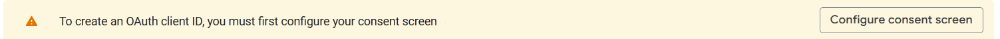
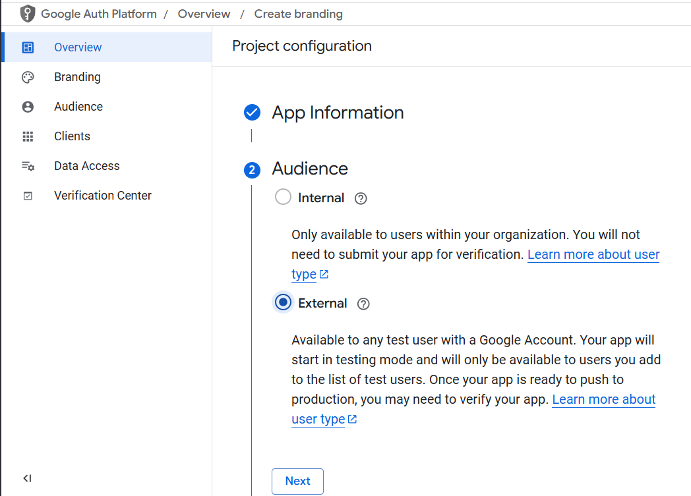
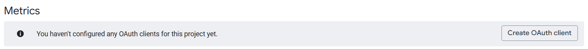
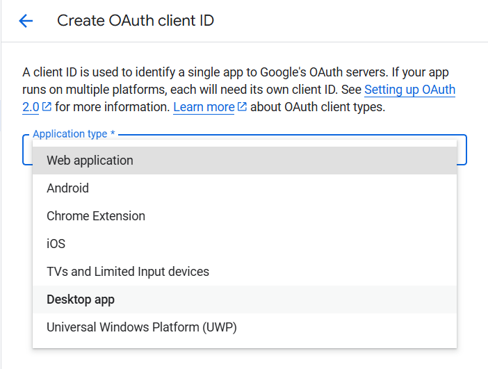
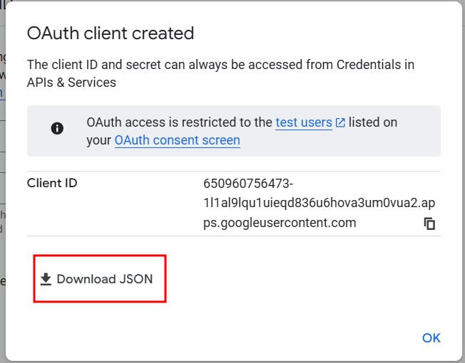

## Initial setup

## Sending emails

### From the email address that will be used to contact all owners:
### 1. Create a Cloud project: https://console.cloud.google.com/projectcreate
### 2. Enable Gmail API: https://console.cloud.google.com/apis/library/gmail.googleapis.com ­→ `ENABLE`
### 3. Create OAuth client: https://console.cloud.google.com/auth/clients/create
  - This will prompt you to create "Branding" for this "app"
  
#### 3a. Creating the "app"
  - Fill out all info and press "Create"
  - Name the app "NeuroPoly Drive Migration"
  - For the audience, choose "External"

  
#### 3b. Press "Create OAuth Client"

#### 3c. Select "Desktop app" as "Application Type"


#### 3d. Create the app and select "Download JSON". Save this as `client_secret.json` in the `gdrive-copy-to-shared` directory


- *Note*: If you miss this download, you can download from the [client list](https://console.cloud.google.com/auth/clients)
  using the download icon under "Actions"

#### 3e. Add yourself as a test user

Under [Audience](https://console.cloud.google.com/auth/audience?inv=1&invt=AbtALA&project=gdrive-email-test&supportedpurview=project)
→ Test users, click the `Add users` button

### 4. Make sure `owners.csv` is accessible to the script

Run `main.py` or obtain a copy.

### 5. Run the command to generate drafts to all file owners

#### 5a. From the share link of the drive folder, get the ID and resource key

The share link will be of the form

```
https://drive.google.com/drive/folders/[[FOLDER_ID]]?resourcekey=[[RESOURCE_KEY]]&usp=sharing
```

#### 5b. Run the script

Replace:
- `YOUR_EMAIL`: the Google account that created the OAuth client, etc, above
- `DRIVE_FOLDER`: the FOLDER_ID in step 5a
- `RESOURCE_KEY`: the RESOURCE_KEY in step 5a
- `OWNER_EMAIL`: the email to instruct recipients to transfer ownership to. This must be an email
  that is not in any Google Workspace domain

```
python compose_emails.py -f YOUR_EMAIL --drive-folder "DRIVE_FOLDER" --resource-key "RESOURCE_KEY" --owner-target-email OWNER_EMAIL
```
